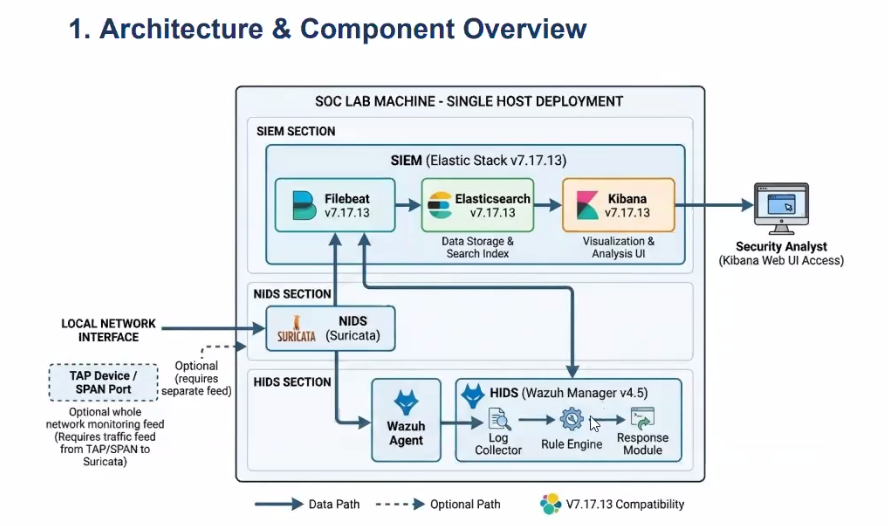

🚀 Automated SOC Components Setup Script
---

:link: Overview

---

Total Wazuh Structure


---


:link: System Requirements


🛠️ Wazuh Setup

1️⃣. Wazuh Server Installation Process :

a)​ First, I went to the GitHub link 
```bash
https://github.com/samiul008ghub/soc_setup/?tab=readme-ov-file
```
followed everything according to the description written in the README section. 


