🚀 Automated SOC Components Setup Script
---

Overview

---

This script automates the setup of a comprehensive security monitoring environment, including a Security Information and Event Management (SIEM) system,Network-based Intrusion Detection System (NIDS) and Host-based Intrusion Detection System (HIDS) on a single machine. It streamlines the installation process, making it accessible to users with different levels of technical expertise.

Note: This script is intended to install all the components on a single machine, meaning the same box will have the SIEM, NIDS, and HIDS core components.

Total Wazuh Structure
---

---


System Requirements

Before running the script, please ensure that your system meets the following requirements:

* Ubuntu OS

* Minimum 4GB of RAM

* Minimum 20GB of free disk space

If your system doesn't meet these requirements, the script will issue a warning and allow you to proceed at your own risk.


---
Components
---
The script facilitates the installation of the following SOC components:


1. SIEM (Security Information and Event Management): This component combines Elasticsearch, Kibana, and Filebeat to provide a powerful platform for monitoring and analyzing security events in your environment. The SIEM setup includes Elasticsearch, Kibana and Filebeat version 7.17.13 as it is the compatible version to integrate with Wazuh manager version 4.5


2. NIDS (Network-based Intrusion Detection System): Suricata, a high-performance NIDS, is configured to help protect your network from intrusions and suspicious activities. Note: Suricata will monitor the local interface of the machine where it is installed. To monitor the entire network traffic, it should receive traffic from a TAP device or a SPAN port.

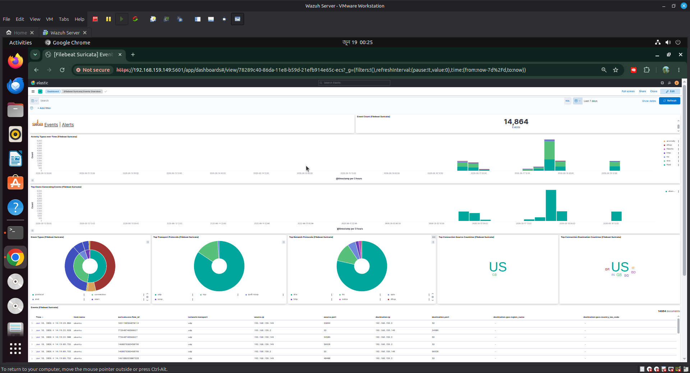

3. HIDS (Host-based Intrusion Detection System): The script installs the Wazuh Manager, an open-source HIDS. It aids in monitoring, detecting, and responding to security threats on individual hosts. The setup includes the installation of Wazuh Manager version 4.5

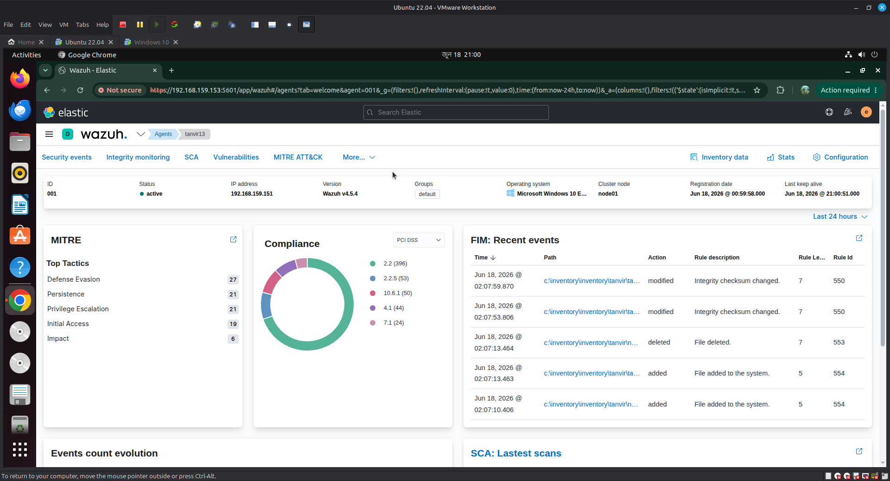

---
🛠️ Wazuh Setup
---


---
1️⃣. Wazuh Server Installation Process :
---

a) At first, I installed Ubuntu 22.04 in VMWare Workstation Pro

b)​ Then, I went to the GitHub link 

🔗 "https://github.com/samiul008ghub/soc_setup/?tab=readme-ov-file"

followed everything according to the description written in the README section. 

## Usage
---

1. Clone this repository to your local machine:

```bash
git clone https://github.com/samiul008ghub/soc_setup/
```

2. Navigate to the repository's directory:

```bash
cd soc_setup
```
3. Make the setup_script.sh executable:

```bash
chmod +x setup_script.sh
```
4. Execute the setup_script.sh:

```bash
./setup_script.sh
```
5. Follow the on-screen prompts to choose which components you want to install and continue with the setup. Post-Installation Steps

6. After successfully running the script and completing the NIDS (Suricata) setup, consider the following post-installation steps:

---
Verify NIDS Logs:
---

Check if logs are getting written to the /var/log/suricata/eve.json file. This is essential for monitoring network traffic. Besides, you need to check from kibana if data is being displayed in the Suricata Dashboard.


---
Wazuh-Agent Installation:
---


To complete the setup and ensure effective security monitoring, install Wazuh agents on Linux or Windows machines in your network. This allows you to ingest logs into the SIEM, enhancing your security monitoring capabilities.


---
Warnings and Considerations
---

Data Backup: Before proceeding, it's advisable to back up your data, especially if you plan to run the script on a production system.

---
Security Best Practices
---

After setting up the security components, consider following best practices for system hardening, firewall configurations, and securing sensitive data.

---

The starting process of the Wazuh Server

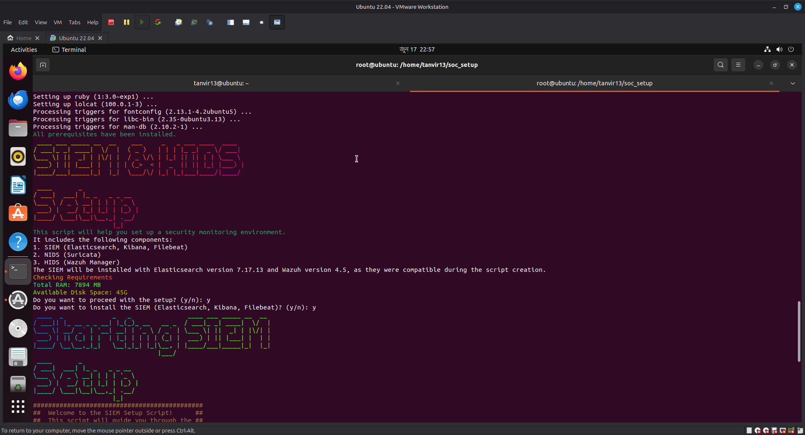

Here, I typed the password for my Wazuh Server 

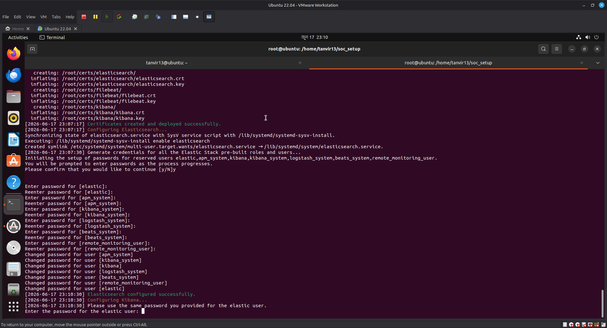

Time of Processing the Wazuh Server in terminal ......

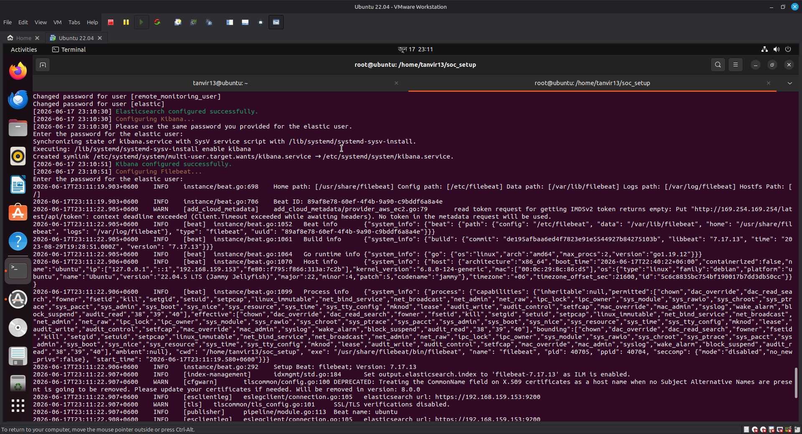

Here, I attempted to install suricata by typing y in the terminal

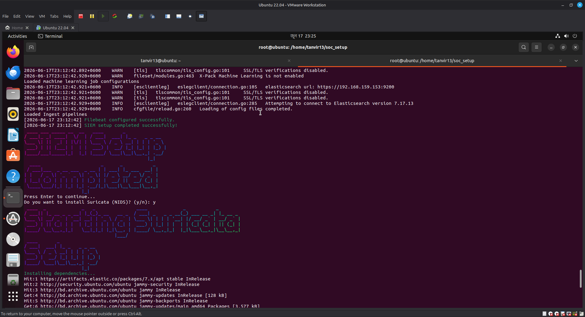

Here, I typed password for kibana, kibana system, elastic, logstash_system, remote_monitoring_system, apm_system, beat_system  


This is the complete installation of Wazuh Server in the terminal of Ubuntu 22.04

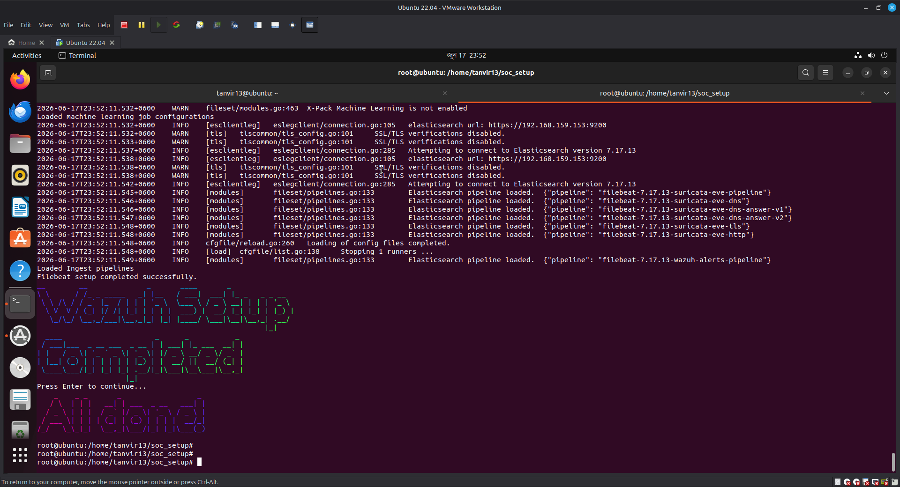


These are the screenshots of the installation of the Wazuh setup 

Then I went to the browser & typed 

```bash
https://192.168.159.153:5601
```
You have to do this according to your IP address & port will be 5601

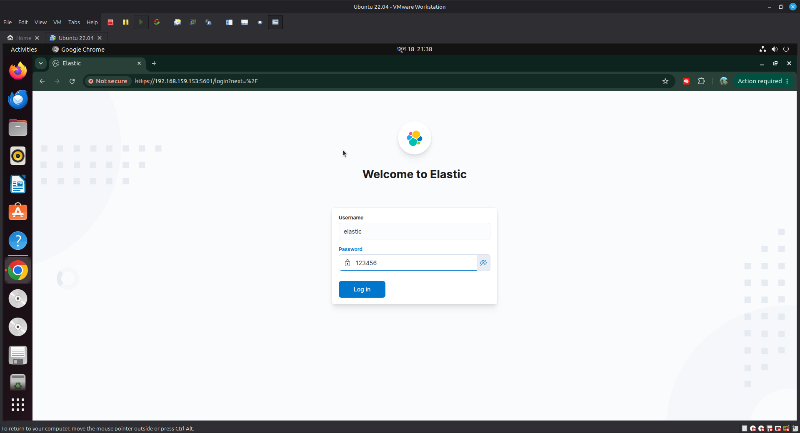

---
2️⃣. Wazuh Agent Installation Process :
---

a) First, I went to the "Deploy new agent" according to the screenshot below 

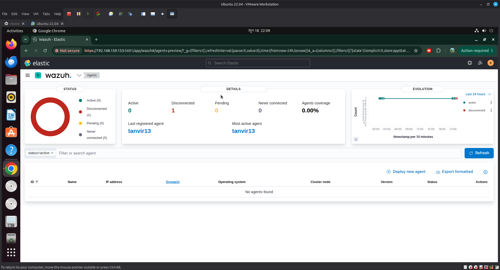

b) Then I choose the operating system, version, and architecture 

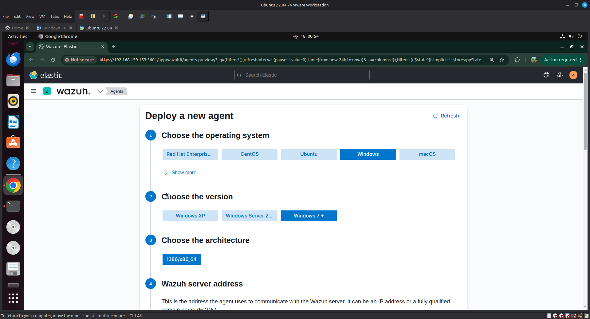

c) In the Wazuh Server address, I typed my IP address of Ubuntu 22.04, assigned the agent name as tanvir13, & select default in the group

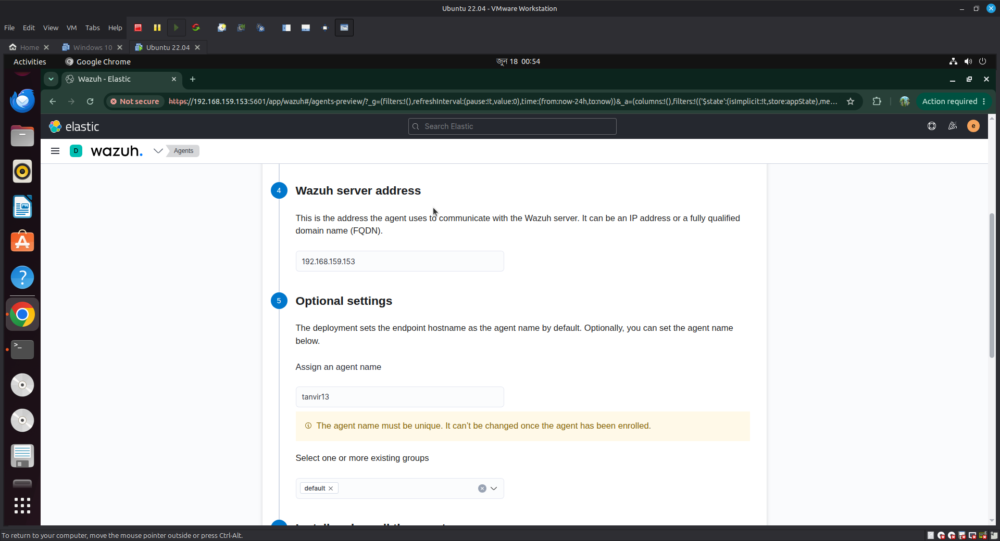

d) Here is the command of the Wazuh agent from the Wazuh server. I copied the command 

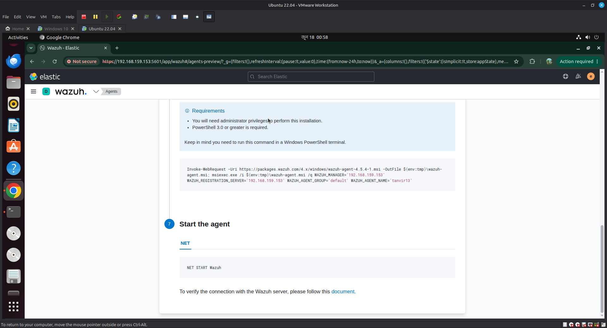

e) In my Windows 10 machine, I opened PowerShell as administrator & copied the command that I got from the Wazuh server

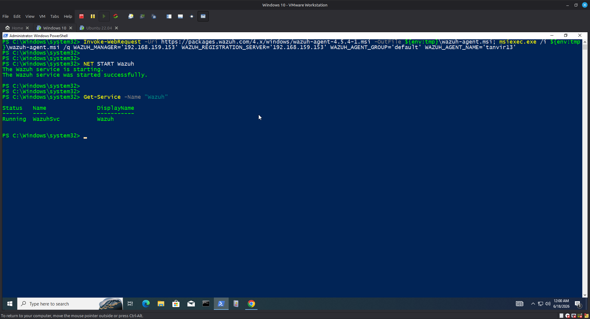

Here I typed the command in PowerShell that I found on the Wazuh server. 

```bash

Invoke-WebRequest -Uri https://packages.wazuh.com/4.x/windows/wazuh-agent-4.5.4-1.msi -OutFile ${env:tmp}\wazuh-agent.msi; msiexec.exe /i ${env:tmp}\wazuh-agent.msi /q WAZUH_MANAGER='192.168.159.149' WAZUH_REGISTRATION_SERVER='192.168.159.149' WAZUH_AGENT_GROUP='default' WAZUH_AGENT_NAME='tanvir13' 

```

Then I started the Wazuh agent 

```bash
NET START Wazuh
```

Then I check the status of the Wazuh Agent
```bash
Get-Service -Name "Wazuh"
```

If you need to restart Elastic Search, Kibana, Filebeat, and Suricata

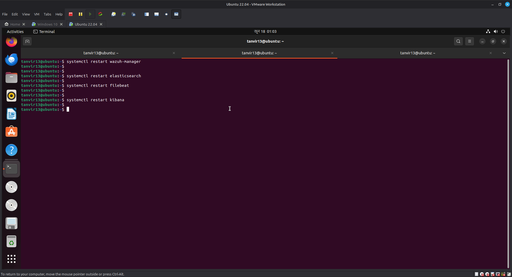

To restart Suricata
```bash
sudo systemctl restart suricata
```

To restart Filebeat
```bash
sudo systemctl restart filebeat
```

To restart ElasticSearch
```bash
sudo systemctl restart elasticsearch
```
To restart Kibana
```bash
sudo systemctl restart kibana
```

If you want to see the status of Elastic Search, Kibana, Filebeat, and Suricata

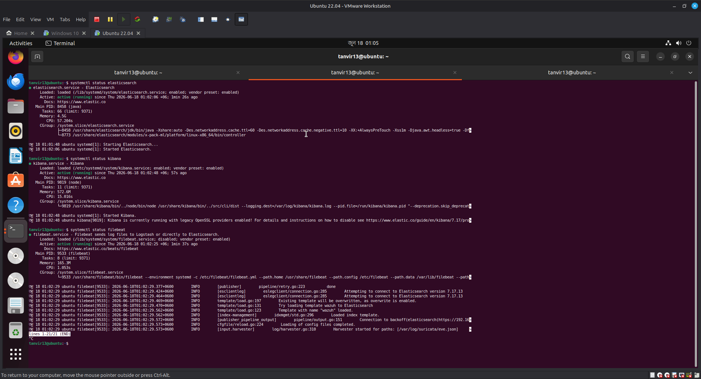

To see the status of Suricata
```bash
sudo systemctl status suricata
```

To see the status of Filebeat
```bash
sudo systemctl status filebeat
```

To see the status of ElasticSearch

```bash
sudo systemctl status elasticsearch
```

To see the status of Kibana

```bah
sudo systemctl status kibana
```


---
3️⃣. Sysmon Installation Process in Windows 10:
---

I downloaded the Sysmon from the link & extracted it

🔗 “https://learn.microsoft.com/en-us/sysinternals/downloads/sysmon”

& sysmonconfig.xml file from the link, & placed it into the extracted Sysmon folder

🔗 “https://github.com/olafhartong/sysmon-modular/blob/master/sysmonconfig.xml”


Here is the position of all of the Sysmon components in my Windows 10

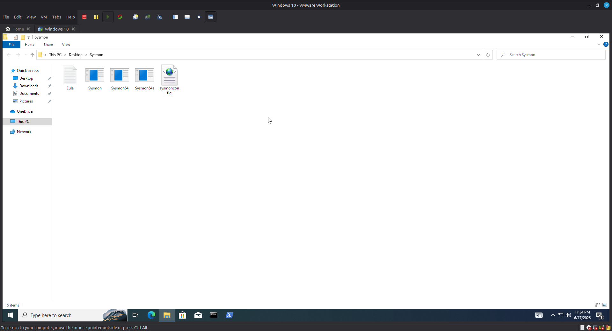

I installed it with the

```bash
.\Sysmon64.exe -i .\sysmonconfig.xml
```
command & checked the sysmon with the command

```bash
Get-Service -Name Sysmon64
```

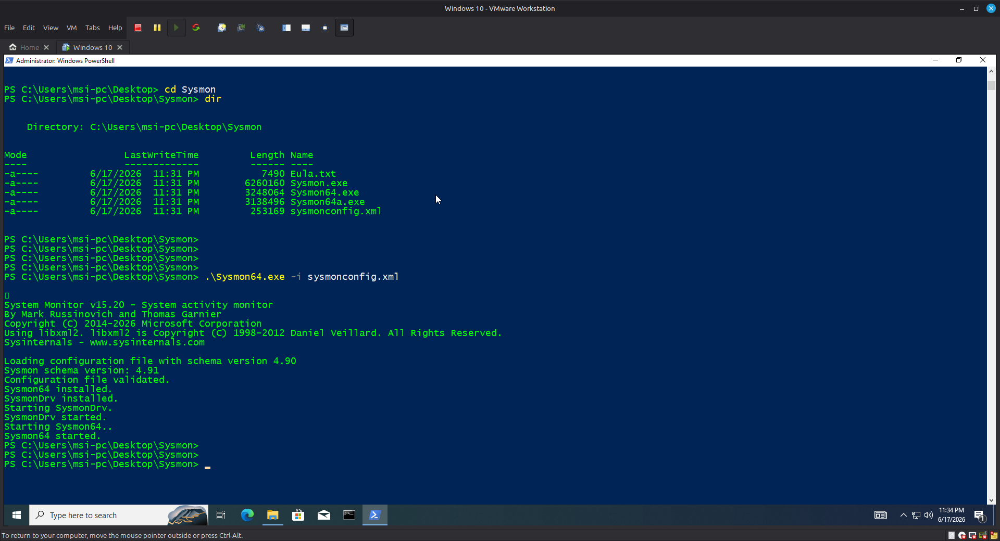

Here, I also checked Sysmon in the Event Viewer

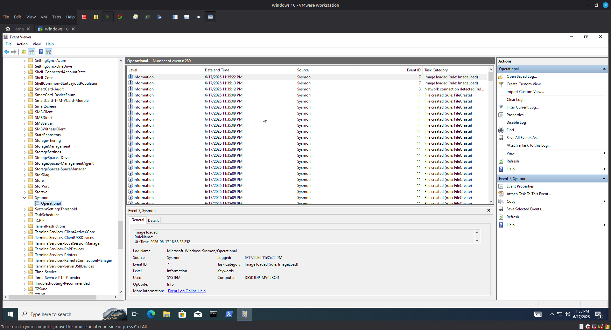

Here, I went to the ossec.conf file

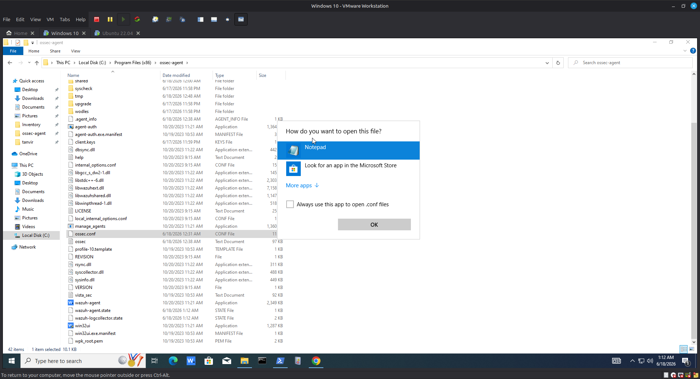

Then, I typed the above thing in the Log analysis section of ossec.conf

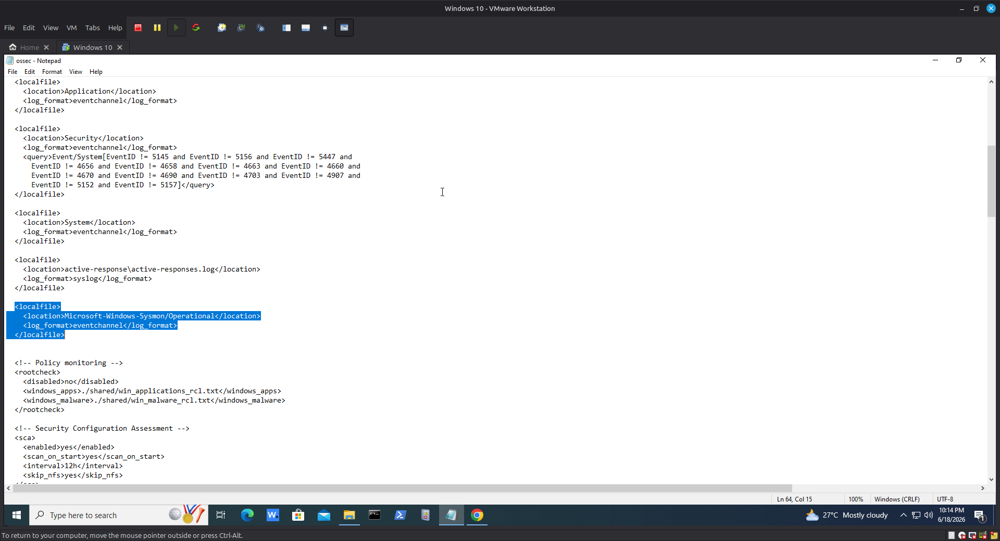

```bash
<localfile>
    <location>Microsoft-Windows-Sysmon/Operational</location>
    <log_format>eventchannel</log_format>
</localfile>
```

Then I restart the Wazuh Agent

```bash
restart wazuh agent
```


---
4️⃣. Detecting Alerts in the network system by Suricata:
---

a) At first, I went to the terminal & write it 

```bash
cd /etc/suricata
```

Then, I checked the suricata.yaml & write the above command in the terminal to see the suricata.rules

```bash
cat suricata.yaml
```

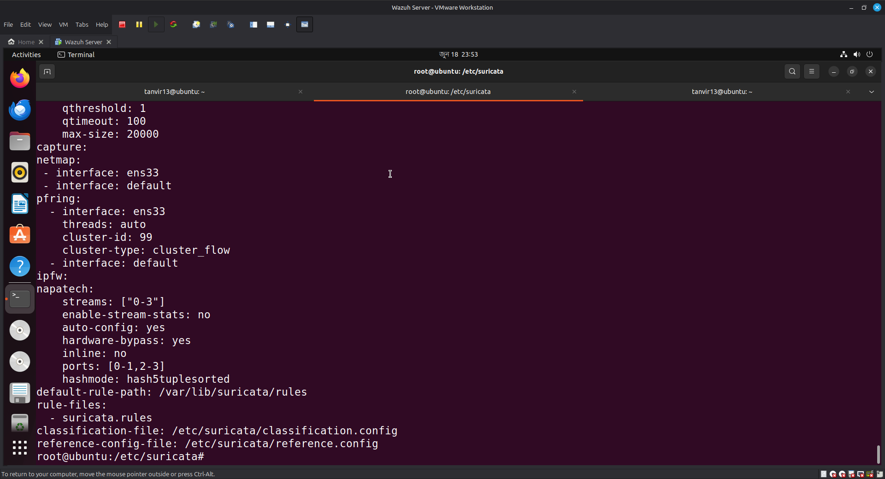

b) Here is the location of suricata rules

```bash
cd /var/lib/suricata
```

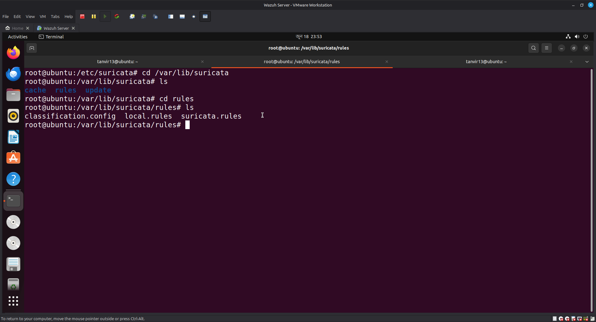

c) I type the alert rules by using nano in local.rules

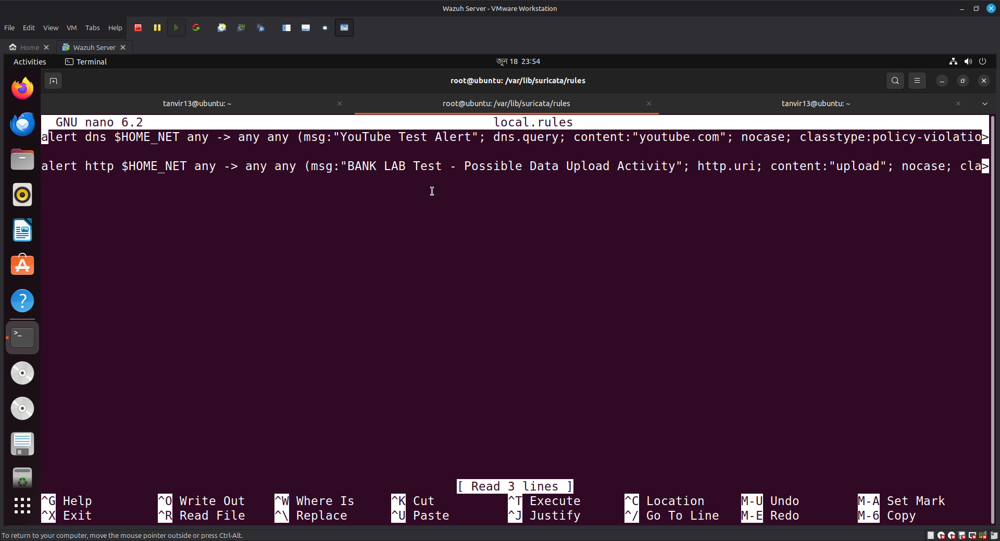

Here, it is the rules in the local.rules

```bash

alert dns $HOME_NET any -> any any (msg:"YouTube Test Alert"; dns.query; content:"youtube.com"; nocase; classtype:policy-violation; sid:1000001; rev:1; metadata:created_at 2026_06_09, deployment Perimeter, confidence Low, signature_severity Minor, tag Test;)

alert http $HOME_NET any -> any any (msg:"BANK LAB Test - Possible Data Upload Activity"; http.uri; content:"upload"; nocase; classtype:policy-violation; sid:1000103; rev:1; metadata:banking_lab exfil_simulation;)

```

d) Then, I checked if there were any errors in the rules that I wrote local.rules

```bash
suricata -T -c /etc/suricata/suricata.yaml
```
e) Then I restart the suricata & check its status

```bash
systemctl restart suricata && systemctl status suricata
```

f) Then, I typed the above command in the terminal to see by which rules or signature suricata is trying to scan the network

```bash
grep -A 10 "rule-files" /etc/suricata/suricata.yaml
```
---

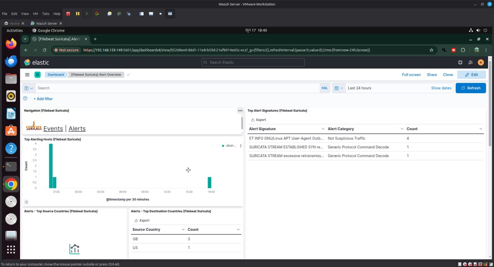

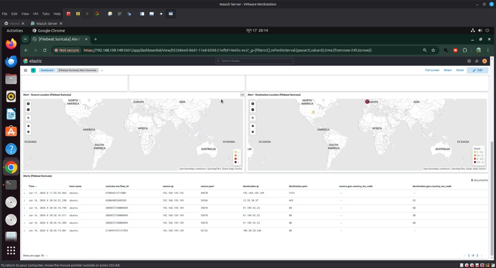

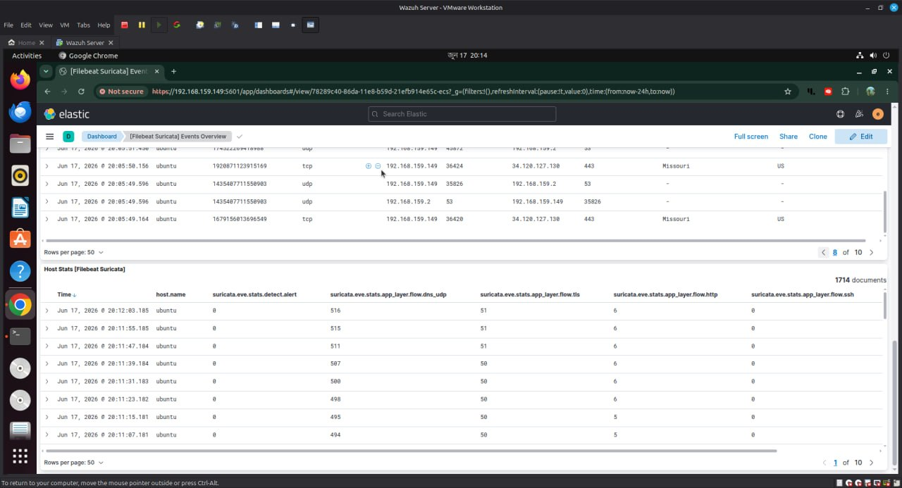


These are the screenshots of suricata

---
5️⃣Integrity monitoring in Wazuh
---


![Image Description]


![Image Description]


